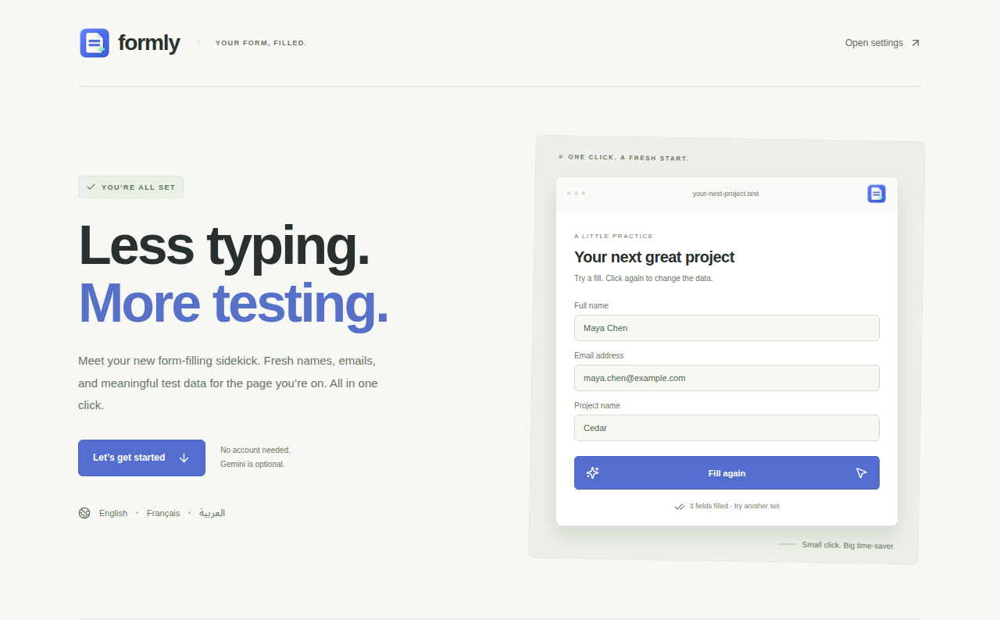
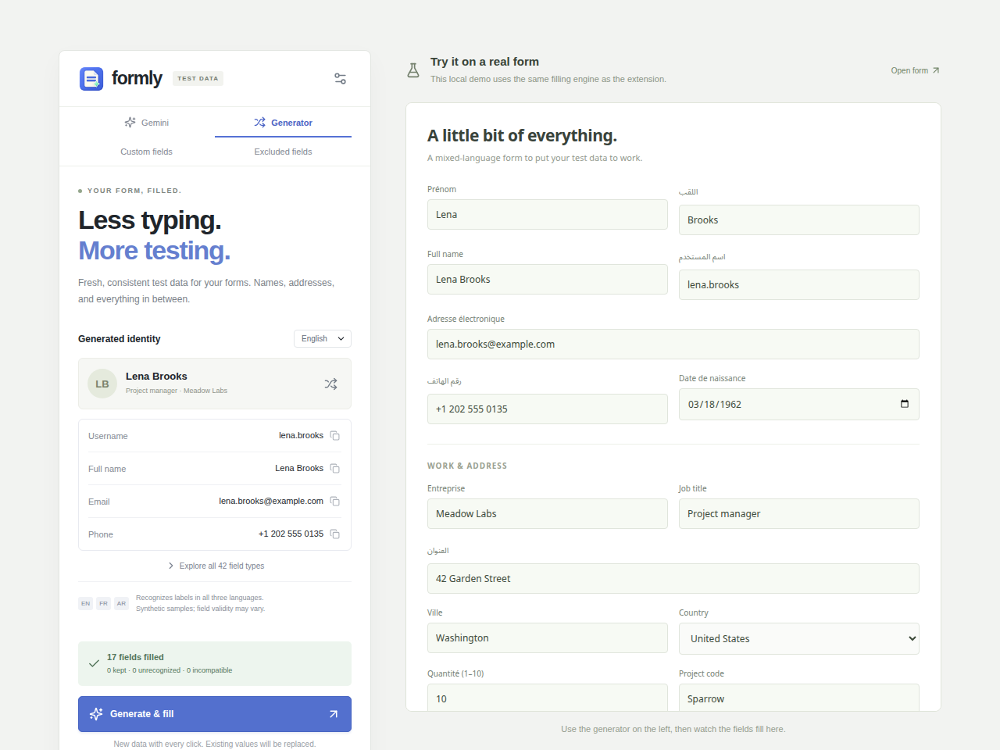
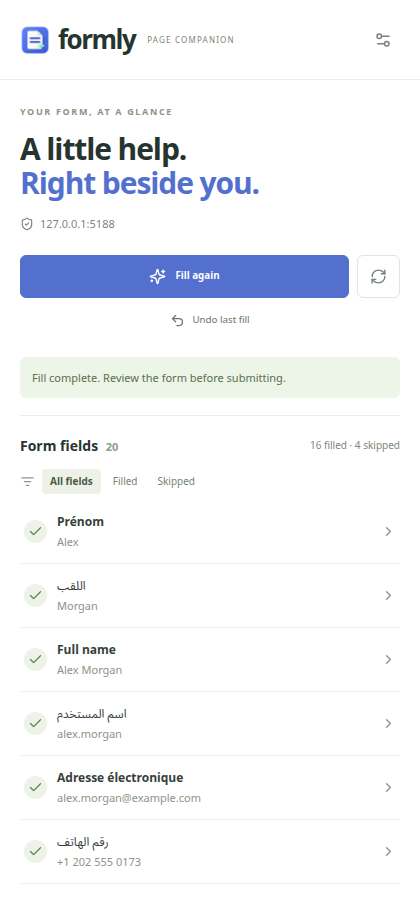
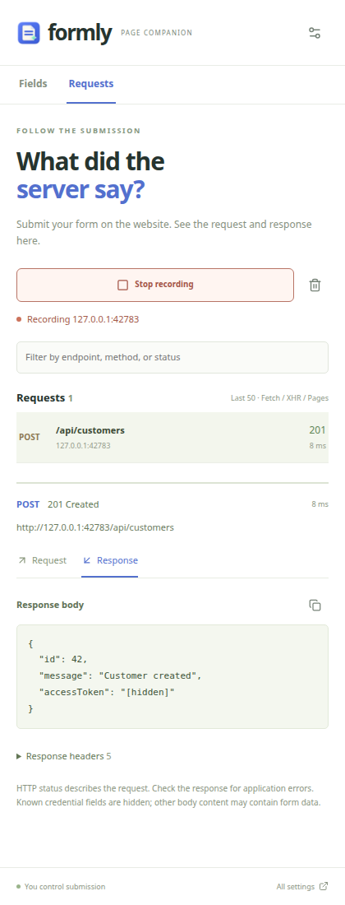
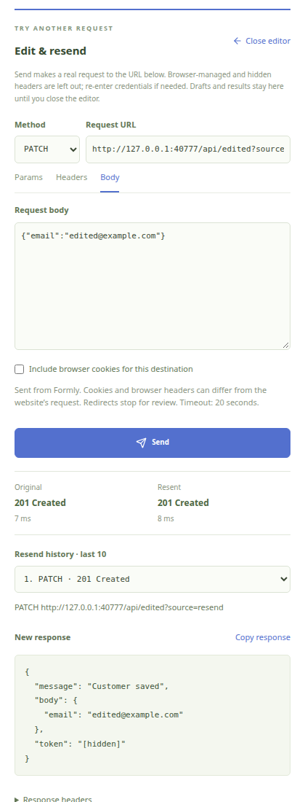

<p align="center">
  
</p>
<h1 align="center">Formly</h1>
<p align="center"><strong>Less typing. More testing.</strong></p>
<p align="center">Fill website forms with fresh, fictional test data in one toolbar click.</p>
<p align="center">
  <a href="https://github.com/gouderhaithem/form-filler/actions/workflows/ci.yml"></a>
  
  
  
</p>
<p align="center">
  <a href="#quick-start">Quick start</a> ·
  <a href="docs/presentation/README.md">Presentation</a> ·
  <a href="docs/USER_GUIDE.md">User guide</a> ·
  <a href="#development">Development</a>
</p>



Formly is a browser extension for developers and QA testers who repeatedly fill forms while building and testing websites. Click the toolbar icon to generate names, matching usernames and emails, addresses, dates, and other readable values. Click again for another set.

**Local generation works without an account or API key. You decide when to submit the form.**

## Features

| | What you can do |
| --- | --- |
| **Request inspector** | Record a tab’s submissions and inspect endpoints, payloads, headers, HTTP status, timing, and responses. |
| **Side panel** | Inspect filled/skipped fields beside the website, highlight a control, and save a custom value or exclusion. |
| **Undo last fill** | Restore the previous values while preserving fields you edited afterward. |
| **One-click filling** | Fill the active page directly from the toolbar and see the filled-field count on the icon. |
| **42 field categories** | Generate fictional identities, contact details, work information, addresses, numbers, dates, and text. |
| **English, French & Arabic** | Recognize labels in all three languages and choose a language for generated data. |
| **Custom values** | Map your own labels to exact test values, such as `Project code` → `PRJ-001`. |
| **Field exclusions** | Protect fields by label or CSS selector, optionally scoped to a website. Search and navigation controls are skipped by default. |
| **Optional Gemini** | Prepare contextual suggestions for unfamiliar fields using your own API key, with local fallback. |
| **Cache controls** | Keep Gemini suggestions for 1–60 minutes, see their expiry, or clear them immediately. |

## Quick start

Use **Node.js 22** and npm for the same runtime as CI.

```sh
git clone https://github.com/gouderhaithem/form-filler.git
cd form-filler
npm ci
npm run build
```

1. Open `chrome://extensions` in Chrome or `edge://extensions` in Edge.
2. Enable **Developer mode**, then click **Load unpacked**.
3. Select the generated **`dist/` folder**.
4. Follow the welcome guide and pin Formly to your toolbar.
5. Open a page with a form and click the Formly icon.

Right-click the icon and choose **Options** to change the generated language, add custom values, or configure exclusions. To update an existing installation, rebuild and click **Reload** on its extension card.

### Try the local demo

```sh
npm run dev
```

Open [the local preview](http://127.0.0.1:5187/), choose **Generator**, and click **Generate & fill**. This preview uses the same local filling engine as the extension.



### Open the side panel

Right-click the Formly toolbar icon and choose **Open Formly panel**, or press **Alt + Shift + F**. The panel opens beside the current website. A normal toolbar click continues to fill the page immediately.

- Review each field's filled/skipped status and reason. Hidden inputs are omitted and password values are masked.
- Select a field to highlight it on the page, save a custom test value for that field on that hostname, or exclude it.
- Click **Fill this page / Fill again** to apply your settings, or **Undo last fill** to restore the last set of changes.
- Switch tabs or reload a page and the panel refreshes its field list. A new website may need a toolbar click or reopening the panel from the icon's menu to grant access.

Undo keeps one fill per document, preserves later manual edits, and resets when the document reloads. Previous values stay in the page's isolated extension context and never go to Gemini. Undo restores form controls, not other effects a website may trigger when a value changes.

Requires Chrome 118+ or an Edge version supporting the Side Panel API. Change a conflicting shortcut at `chrome://extensions/shortcuts` or `edge://extensions/shortcuts`.



### Inspect submitted requests

Open the side panel → **Requests → Start recording**, then submit your form on the website. Select a captured request to see its endpoint, method, submitted data, headers, HTTP status, elapsed time, and response. JSON is formatted for reading, and you can copy the displayed body.



Recording is off by default. Chrome requires the **`debugger` permission** for response capture and displays a debugging notice while recording. Recording stops when you click Stop, switch tabs in that window, close the recorded tab, or Chrome detaches the debugger. Opening DevTools or using another debugger can interrupt capture.

- Captures stay in service-worker memory and **never go to Gemini** or extension storage. Closing the recorded tab clears its history. Starting a new recording replaces the previous history.
- The inspector keeps the latest **50 Fetch, XHR, and document requests**, including redirect hops. It does not identify which request belongs to a form automatically.
- Request and response text previews are limited to **64 KB each**. Binary responses and multipart payloads are omitted. Streams, browser-evicted bodies, and requests in separate iframe/worker targets may be unavailable.
- Known credential headers and named JSON/form fields are hidden. Other text or HTML can contain submitted information. Review the displayed data before copying it.
- HTTP success does not guarantee application success. Read the response for validation errors.

### Edit and resend a request

Select a captured request → **Edit & resend**. Change the method, URL, **Params**, **Headers**, or **Body**, then click **Send**. A send makes a real request; it can create or change server data. Chrome asks for access to the destination host if needed. Recording can be stopped while you edit and send.



The editor shows the new response, status, duration, and headers alongside the original status. Expand **Original response** to compare bodies. The latest 10 resend results include a redacted snapshot of what you sent. Closing the editor, leaving Requests, or clearing history discards the draft and results; nothing is saved to disk or sent to Gemini.

- Text, JSON, and URL-encoded bodies up to 64 KB are supported. GET and HEAD send no body. Multipart uploads are not supported.
- Hidden credentials are not recovered. Re-enter required credentials; unresolved `[hidden]` values block sending. Browser-managed headers are omitted from the draft.
- Requests run from the extension using Fetch, so browser headers and authentication can differ from the website. Cookies are off by default; enable **Include browser cookies** if needed. Chrome’s cookie rules still apply.
- Redirects stop for review instead of being followed automatically. Chrome may hide a redirect’s status and headers. Requests time out after 20 seconds; Cancel stops waiting, but the server may already have received the request. No automatic retries.

The destination access uses Chrome’s existing optional host permissions. See [Chrome’s network request documentation](https://developer.chrome.com/docs/extensions/develop/concepts/network-requests) and [runtime permissions API](https://developer.chrome.com/docs/extensions/reference/api/permissions).

### Optional Gemini setup

In the installed extension, open **Options → Gemini**, enter your own API key, and click **Test key**. Choose an available model, enable **Use Gemini for unknown fields**, save, and accept the browser's website-access request.

Reloading a page prepares suggestions. Clicking the toolbar fills the form. Recognized fields use the local engine, and failed requests fall back to local data. Gemini requests use your Google project's quota and billing settings.

See the [complete user guide](docs/USER_GUIDE.md#gemini-optional) for cache behavior, settings, permissions, and troubleshooting.

## Presentation

A six-slide product walkthrough covers the filling workflow, supported fields, optional Gemini, privacy, and installation.

**[View the presentation on GitHub](docs/presentation/README.md)** · **[Download the editable PowerPoint](docs/presentation/formly.pptx)**

## Privacy and boundaries

- Settings, custom values, and exclusions stay in local extension storage. There is no browser sync or Formly backend.
- Gemini is optional. Its prompt contains field metadata, including labels and placeholders, plus the selected language. Entered form values, page URLs, and whole-page HTML are excluded. Labels can still contain website-specific information.
- Your Gemini key stays in local extension storage, which is **not encrypted**, and is sent to Google for API authentication. No shared key is bundled.
- Formly fills the **top-level document**. Frames, shadow DOM, rich-text editors, and custom widgets need additional adapters.
- File uploads, hidden/disabled/read-only controls, and detected consent, payment, and one-time-code fields are skipped. Filling never submits forms automatically. The request editor sends only when you click Send.
- Generated data is fictional. Finite sample pools can repeat, and website-specific validation may reject values. Address and phone regions do not necessarily match the selected language.

The extension uses `activeTab`, `scripting`, `storage`, and `alarms`, plus `sidePanel` and `contextMenus` for the page companion. The `debugger` permission supports opt-in request recording. Automatic Gemini preparation requests optional HTTP/HTTPS website access. [Full privacy and permissions details →](docs/USER_GUIDE.md#privacy--permissions)

## Development

Built with **React 19**, **TypeScript**, **Vite**, and **Manifest V3**. Vitest covers the generator and filling logic, while Playwright exercises the interface and a real Chromium extension.

```sh
npm ci
npm run dev                   # Options preview and local demo on port 5187
npm run build                 # Type-check and build the unpacked extension
npm test                      # Unit tests
npx playwright install chromium
npm run test:e2e              # Browser and extension tests on port 5188
```

Run `npm run build` before the browser tests. CI runs the build and both test suites and uploads an unpacked extension artifact.

| Path | Purpose |
| --- | --- |
| `src/engine.ts` | Field detection, constraints, exclusions, and filling |
| `src/data.ts`, `src/samples.ts` | Fictional values and multilingual samples |
| `src/background.ts` | Toolbar action, Gemini preparation, and session cache |
| `src/gemini.ts` | Provider requests, response validation, and cache configuration |
| `src/RequestsPanel.tsx`, `src/network-recorder.ts` | Request inspector and bounded network capture |
| `src/RequestEditor.tsx`, `src/request-replay.ts` | Editable requests, explicit resends, and response comparison |
| `src/sidepanel.tsx`, `src/panel-page.ts` | Side panel interface, field highlighting, and undo |
| `src/main.tsx` | Options interface and development preview |
| `src/welcome.tsx` | First-install guide and interactive example |
| `public/manifest.json` | Extension entry points and permissions |
| `tests/` | Unit and browser regression coverage |

Google responses are simulated in automated tests. Live Gemini access, the native website-permission prompt, Edge, and arbitrary third-party websites require manual verification.

## Documentation and contributions

- [User guide](docs/USER_GUIDE.md): settings, custom rules, exclusions, cache behavior, and practical limits.
- [Field guide](FIELD_GUIDE.md): supported categories, aliases, and coverage ideas.
- [Implementation notes](PLAN.md): project evolution and future ideas.
- [Brand assets](docs/brand/README.md): icon source and rebuild instructions.

For a bug report, include the browser version, reproduction steps, and a minimal form example with fictional data. Before opening a pull request, run the build and both test suites. Useful next areas include custom widget adapters, regional datasets, and repeatable seeded values.
