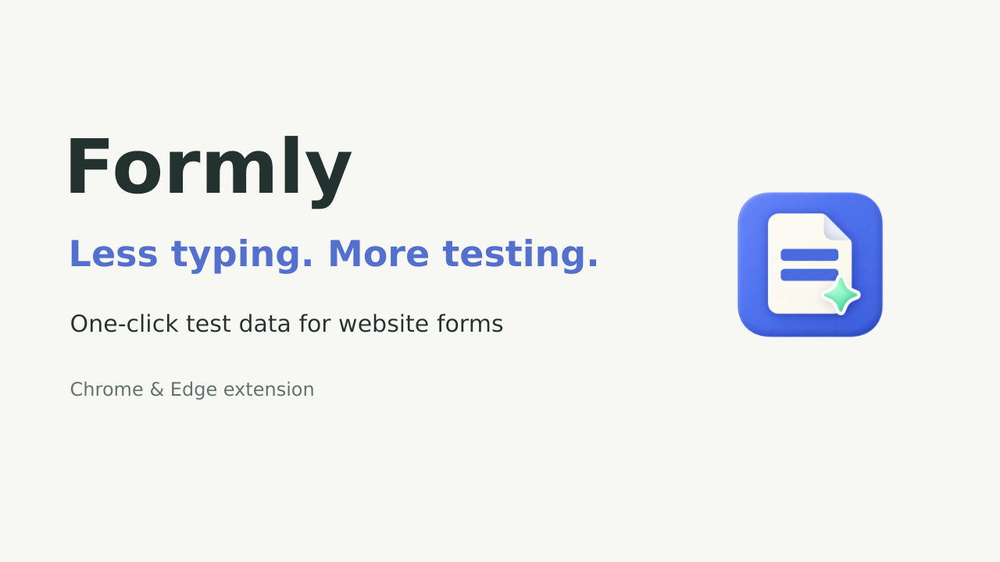
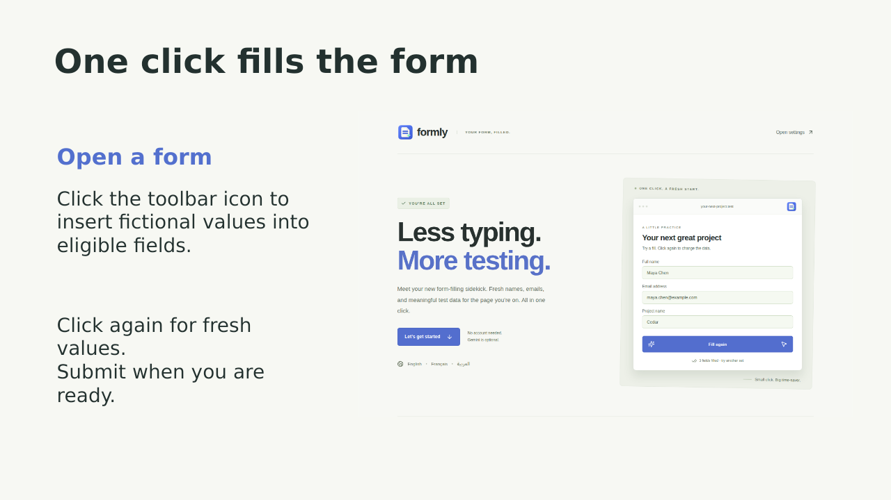
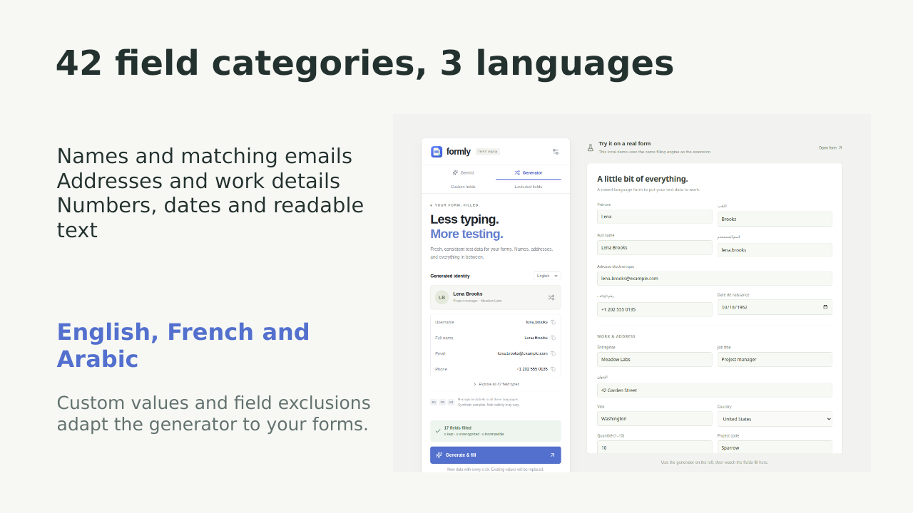
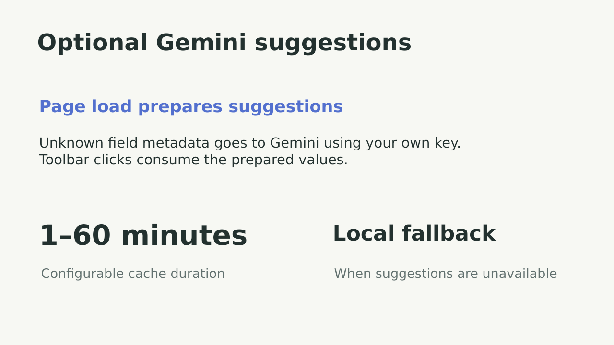
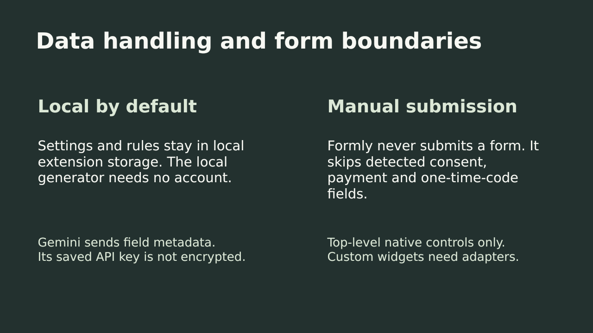
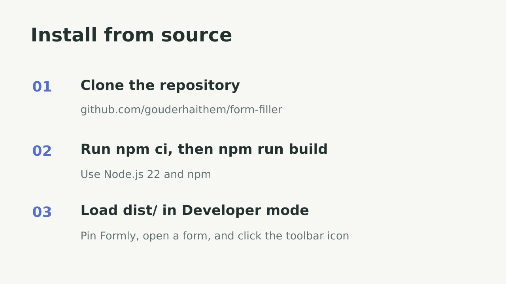

# Formly presentation

A short product walkthrough for developers and QA testers.

**[Download the editable PowerPoint](formly.pptx)** · **[Back to the project](../../README.md)**

## 1. Formly

## 2. One click fills the form

## 3. Field coverage and languages

## 4. Optional Gemini suggestions

## 5. Data handling and form boundaries

## 6. Installation

The PowerPoint includes editable text and source notes. Product screenshots show the local preview and first-install guide using fictional data. See the [user guide](../USER_GUIDE.md) for full behavior and limitations.
